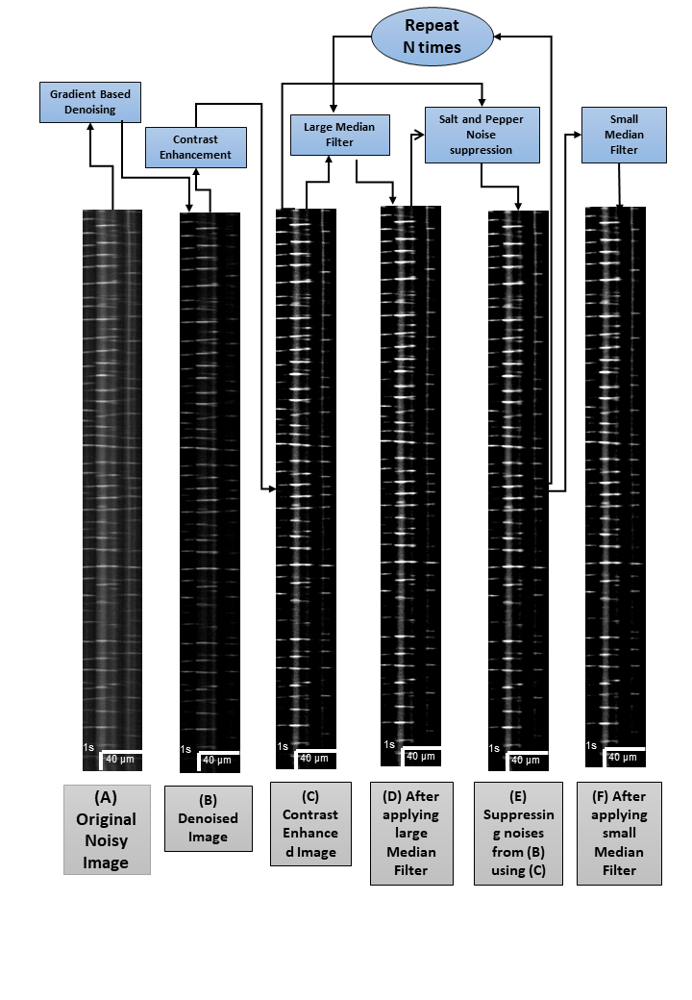

# Automated denoising of calcium signals using mathematical noise modeling
We provide a solution for Ca2+ STMap analysis comprised of an automated denoising workflow that effectively removes background image noise and enhances key Ca2+ event parameters in a fast manner. The module includes optimized tools for Ca2+ signal preprocessing and enhancement of Ca2+ signals in a variety of cell types including the Interstitial Cells of Cajal (ICC). The module can accurately detect and subtract image background noise and expeditiously remove STMap noise such as salt-and-pepper, impulsive, and periodic noise. We found that the module speed of analysis of large-datasets was substantially fast (80-90 millisecond/STMap). The automated denoising module also dramatically reduces user error opportunities and provides a consistent method for high-throughput analysis of STMap datasets.


## Pre-requisite
- Ubuntu 18.04 / Windows 7 or later

## Installation Instruction for Ubuntu/Windows
- Install Pip3
```
https://pip.pypa.io/en/stable/installing/
```
- Install Python3 (Windows)
```
https://www.python.org/downloads/release/python-377/
```
- Install Python (Linux/Ubuntu)

```
sudo apt-get install pip3 python3-dev
```


- Install packages from requirements.txt
```
sudo pip3 -r requirements.txt
```
## Cloning Repository and Defining Image directory

- Clone this repository using the following command in the terminal/command prompt.
```
git clone https://github.com/SharifAmit/CalciumDenoising.git
```
- Create a directory called "Images" inside the repository and put the ICC image files in the directory.
```
mkdir Images
```
## Run the following command in your Command prompt/Terminal

For ICC-MY we use the following command 

```
python3 denoising_pipeline.py --dir=Images --enhance=3 --large_median=15 --small_median=3
```

For ICC-IM we use the following command 

```
python3 denoising_pipeline.py --dir=Images --enhance=3 --large_median=3 --small_median=3 --SOL=True --threshold_SOL=65
```

- There are different flags to choose from. Not all of them are mandatory.

- For ICC-MY we use the following flags.

```
   '--enhance', type=int, default=3
   '--small_median', type=int, default=3
   '--large_median', type=int, default=15 
   '--dir', type=str, required=True, help='path/to/images'
```

- For ICC-IM we use the following flags. N.B. different image might require different threshold value for streak of light.

```
   '--enhance', type=int, default=3
   '--small_median', type=int, default=3
   '--large_median', type=int, default=3 
   '--dir', type=str, required=True, help='path/to/images'
   '--threshold_SOL', type=int, default=65
   '--SOL', type=bool, required=False, default=False
```
- For using sobel instead of Laplacian for gradient use the following flag.

```
   '--gradient_filter',type=str, required=False, help='Either Laplacian or Sobel', default='laplacian'
```
- For saving plots of intermediate operations use the following flag.
```
   '--plot_signals',type=bool, required=False, help='Plot the signals for sum,gaussian,gradient,zero_crossings', default=False
```
- For creating images for intermediate steps use the following flag.

```
   '--interm',type=bool, required=False, help='save intermediate images', default=False
```
- For saving both images with and without streaks of light use the following flag.

```
   '--median_w_SOL',type=bool, required=False, help='generate both SOL and without SOL images', default=False
```
