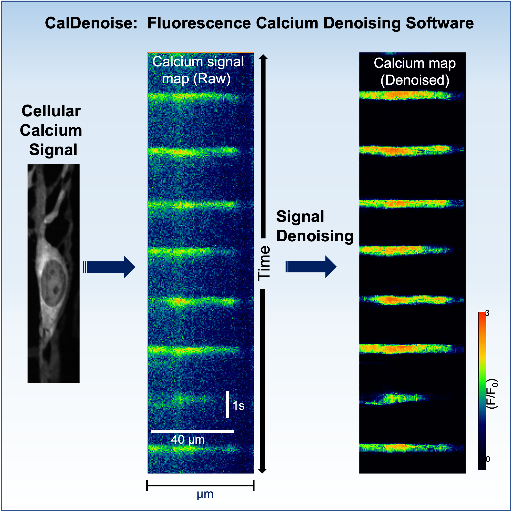
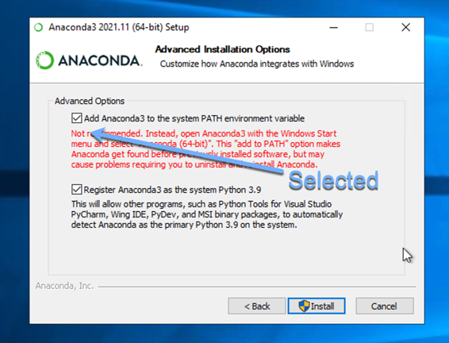
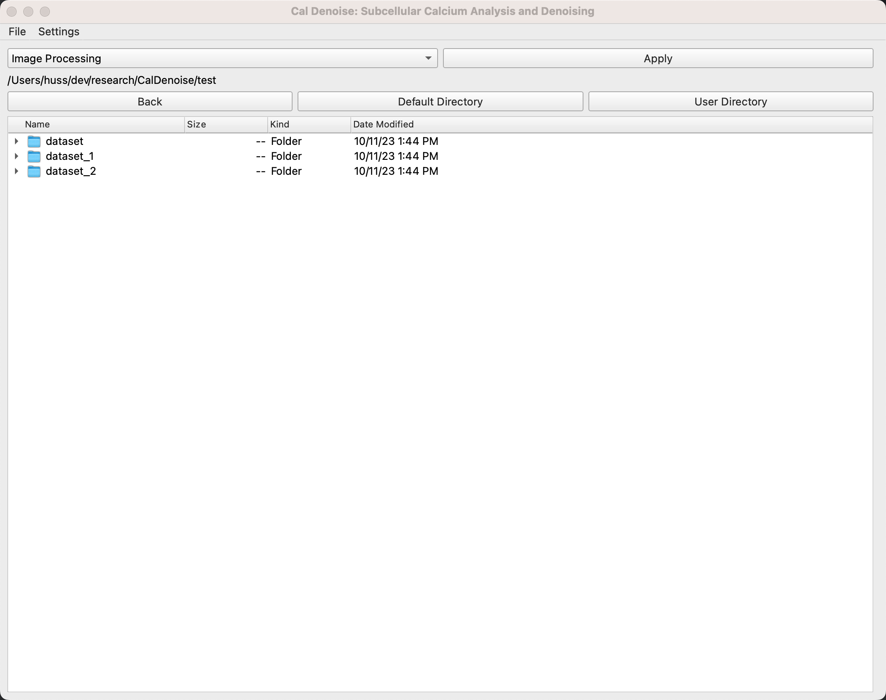
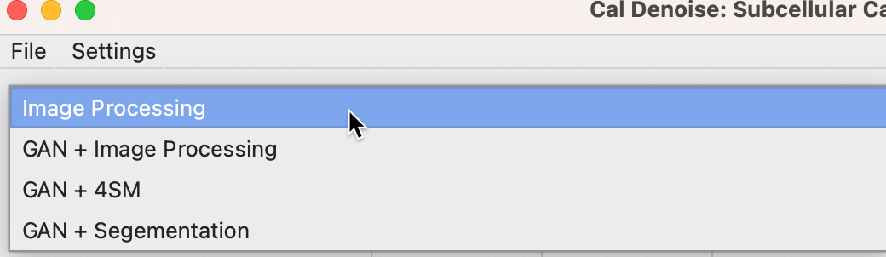
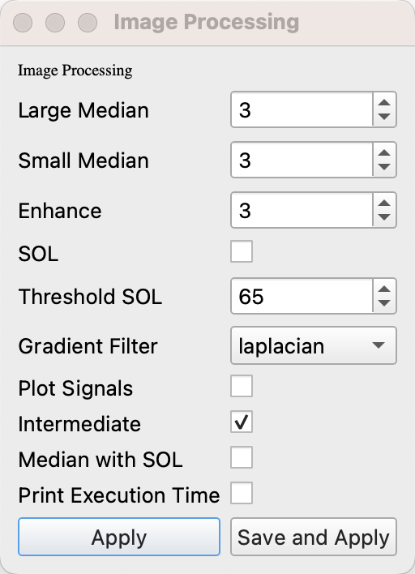
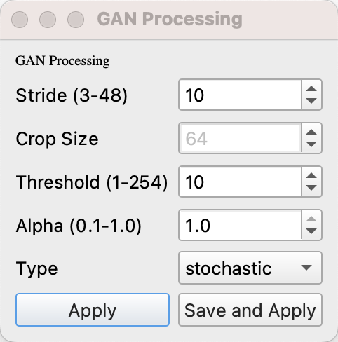

<h4 align="center">
  CalDenoise: Automated Denoising Software for Calcium Imaging Signals Using Deep Learning 
</h4>

<div align="center">
  <a href="#installation-guide"><b>Installation Guide</b></a> |
  <a href="#usage"><b>Usage Guide</b></a> |
  <a href="https://github.com/SharifAmit/CalDenoise/tree/master/test/"><b>Test Dataset</b></a> |
</div>

<br/>

# CalDenoise: Automated Denoising Software for Calcium Imaging Signals Using Deep Learning

We developed CalDenoise, a software designed to automate the denoising of Ca<sup>2+</sup> Spatio-Temporal Maps (STMaps) to quantify cellular Ca<sup>2+</sup> patterns. The software comprises an image-processing-based pipeline and three generative-adversarial-network-based deep learning models capable of removing various types of noise patterns.



# Summary

Ca<sup>2+</sup> signaling is vital for cell survival and death, and Ca<sup>2+</sup> imaging is a common method to study and measure these cellular patterns. Nevertheless, noise from equipment and experimental protocols can hinder the accurate extraction of Ca<sup>2+</sup> signals from the resulting Spatio-Temporal Maps (STMaps). Current denoising methods for STMaps are often time-consuming and subjective. To address this issue, we've developed CalDenoise, an automated software that utilizes robust image processing and deep learning models to effectively eliminate noise, enhancing Ca<sup>2+</sup> signals in STMaps. The software offers four pipelines for noise removal, covering salt-and-pepper, impulsive, periodic noise, and background noise detection and subtraction. It incorporates three deep learning models capable of handling complex noise patterns and accurately distinguishing boundary noise. CalDenoise is adaptable to various cell types, reducing the potential for user errors through its automated denoising modules. The software also features adjustable parameters and a user-friendly graphical interface for ease of access and utilization.


# Highlights

•	CalDenoise: an automated Ca<sup>2+</sup> signals denoising software that effectively removes background image noise.

•	The software features one image-processing pipeline and three GAN models for removing noise from STMaps.

•	CalDenoise: effectively removes STMap noise such as salt-and-pepper, impulsive, and periodic noises.

•	The software enhances the extraction of key Ca<sup>2+</sup> event parameters effectively.

•	The denoising models minimize user error and offer multiple options for end-users to calibrate parameters, enabling efficient denoising of STMap datasets.

# Installation Guide
This guide will help you install and run our application, Calcium denoise, on Windows, Ubuntu, Arch Linux, and Mac (Intel and M1/M2). Please follow the instructions carefully.

## Pre-requisite

- CUDA version 10.0
- List of NVIDIA Graphics cards supporting CUDA 10.0
  https://gist.github.com/standaloneSA/99788f30466516dbcc00338b36ad5acf

## Download and Install Anaconda from the following link

```
https://www.anaconda.com/products/individual
```
Linux or MacOS: Make sure to export your conda bin folder to .bashrc if installing on Linux or  MacOS
```
export PATH="/root/anaconda3/bin:$PATH"
```
Windows: Make sure to select "Add Anaconda(3) to the system Path environment variable" during installation as shown below




## Download and unzip the application from

[Click here to download Calcium Denoise application](https://github.com/SharifAmit/CalDenoise/archive/refs/heads/master.zip)


### Windows users

Run the following command:

```cmd
install_windows.bat
```

### Linux (GPU) users
Run the following command:
```bash
./install_gpu_linux.sh
```
### Special instructions for Linux users
Linux users need to execute a series of additional commands to ensure compatibility. Here are the commands:

```bash
sudo apt-get install libxcb-xinerama0
sudo apt-get install '^libxcb.*-dev' libx11-xcb-dev libglu1-mesa-dev libxrender-dev libxi-dev libxkbcommon-dev libxkbcommon-x11-dev
pip3 uninstall pyqt5 pyqt5-qt5 pyqt5-sip
conda install PyQt5-sip
pip install pyqt5 pyqt5-qt5
conda remove --force qt-main
pip uninstall opencv-python
pip install opencv-python-headless
export LD_LIBRARY_PATH="$LD_LIBRARY_PATH:$(dirname "$(readlink -f "$0")")/4conda/lib"
```
Users on other platforms can skip this step.

### Mac (Intel & M1/M2) users
Run the following command:
```bash
./install_m1m2.sh
```

### Running the Application
To run the application on macOS or linux, execute the following command:

```bash
./run_gpu_linux.sh
```
Windows users should run this command:
```bat
./run_windows.bat
```
Now, Calcium denoise should be up and running on your machine!



# Usage

## Denoising pipelines
The software features one image-processing pipeline and three GAN models for removing noise from STMaps as shown below:




### Image-Processing pipeline input:




### GAN pipelines input:



- **Threshold :**
  As the predicted image is a probability map with values between 0 to 255. The user can pick a threshold value  (= 1 to 254) to make this image into a binary image with values of 0 and 255.

- **Stride:**
  Calcium Denoise creates multiple small patches of image by using fixed sized overlapping crops from one test image. The image size can vary, but the crop size is fixed ( 64x64). By default we use a stride size of 3. However, having a larger stride will create a small number of crops from each test image and a smaller stride will yield a larger number of cropped images. Contrarily, larger strides will give faster yet poor visual results, whereas smaller strides will give slower yet high-quality visual results.
  For example: Given Image size = 128 x 128, if we choose stride= 64, then the number of cropped images will be 4. If the stride = 8, the number of cropped images will be 81.


### Batch Processing:


### Single Image Processing


# License
The code is released under the GPL-2 License, you can read the license file included in the repository for details.