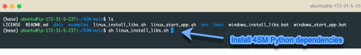
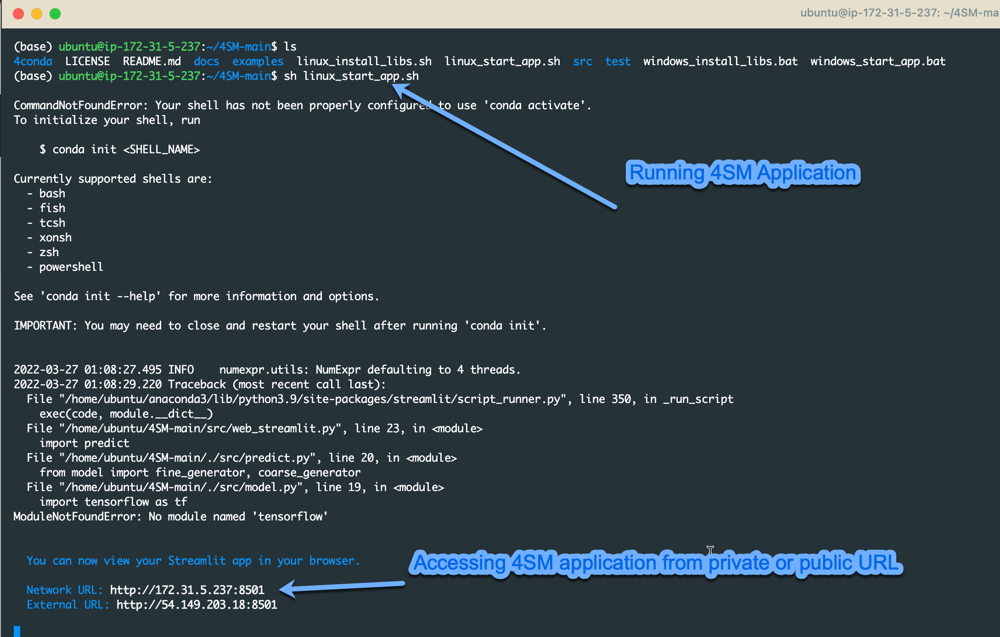

# Ubuntu 18 / Linux 64 Installation

### Pre-requisite
- Ubuntu 18.04 or later
- CUDA version 10+
- List of NVIDIA Graphics cards supporting CUDA 10+
      https://gist.github.com/standaloneSA/99788f30466516dbcc00338b36ad5acf


### 1. Download and Install Anaconda from the following link

```
https://www.anaconda.com/products/individual
```
Make sure to export your conda bin folder to .bashrc
```
export PATH="/root/anaconda3/bin:$PATH"
```

### 2. Download and unzip the application from

[Click here to download Calcium Denoise application](https://github.com/SharifAmit/CalDenoise/archive/refs/heads/master.zip)

### 3. Install Python libraries dependencies 

In the root folder of the unzipped project, run the following shell script
```
sh linux_install_libs.sh
```

  

This step will create Anaconda's environment and install all python dependencies

# Running the application
Run the following shell script in the root folder of the application
```
sh linux_start_app.sh
```

 


## Common installation issues

### Ubuntu
```
ImportError: libGL.so.1: cannot open shared object file: No such file or directory
```
Run
```
apt-get update && apt-get install -y python3-opencv
```


