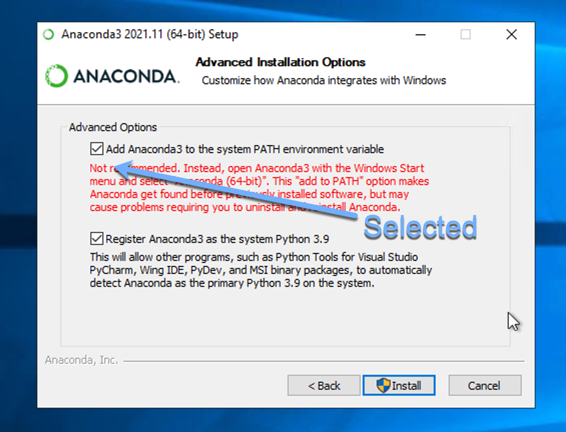
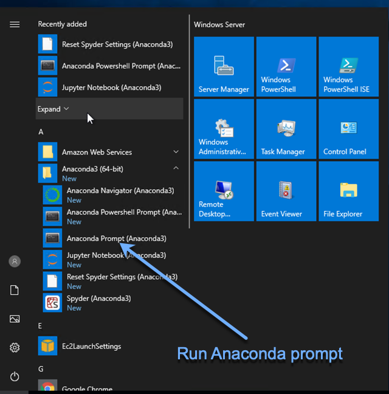
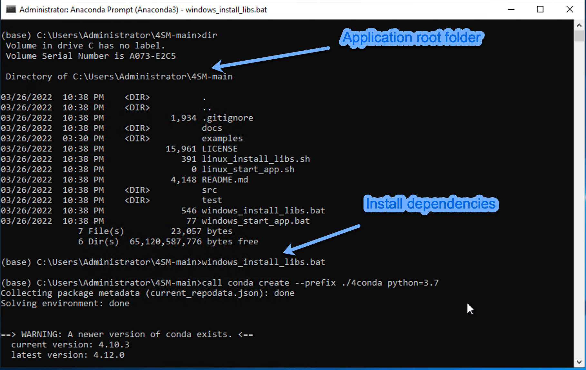

# Windows Installation 

## Pre-requisite
- Windows 7 or later
- CUDA version 10+
- List of NVIDIA Graphics cards supporting CUDA 10+
      https://gist.github.com/standaloneSA/99788f30466516dbcc00338b36ad5acf


### 1. Download and Install Anaconda from the following link
    
[https://www.anaconda.com/products/individual](https://www.anaconda.com/products/individual)

Important: Make sure to select "Add Anaconda(3) to the system Path environment variable" during installation as shown below

  

### 2. Download and unzip the application from

[Click here to download Calcium Denoise application](https://github.com/SharifAmit/CalDenoise/archive/refs/heads/master.zip)

### 3. Install Python libraries dependencies 

In the root folder of the unzipped project, double click on the following script
```
windows_install_libs.bat
```
This step will create Anaconda's environment and install all python dependencies

# Running the application
To run your application, simply double click on the batch script in the root folder of the project
```
windows_start_app.bat
```

# Troubleshooting
 
#### 1- Anaconda path cannot be found
If double clicking on the batch files is not working because it cannot find Anaconda executable path, you can always run Anaconda bash mode as shown below

- Activate "Anaconda prompt"

  

- Navigate to the root folder of the application and install the dependencies by running 
```windows_install_libs.bat```

 

- Run the application by running 
```windows_start_app.bat```


#### 2- Blank page when opening the application

Make sure you are not using an older version of internet explorer. It is recommended to use Google Chrome, Microsoft Edge, or FireFox
